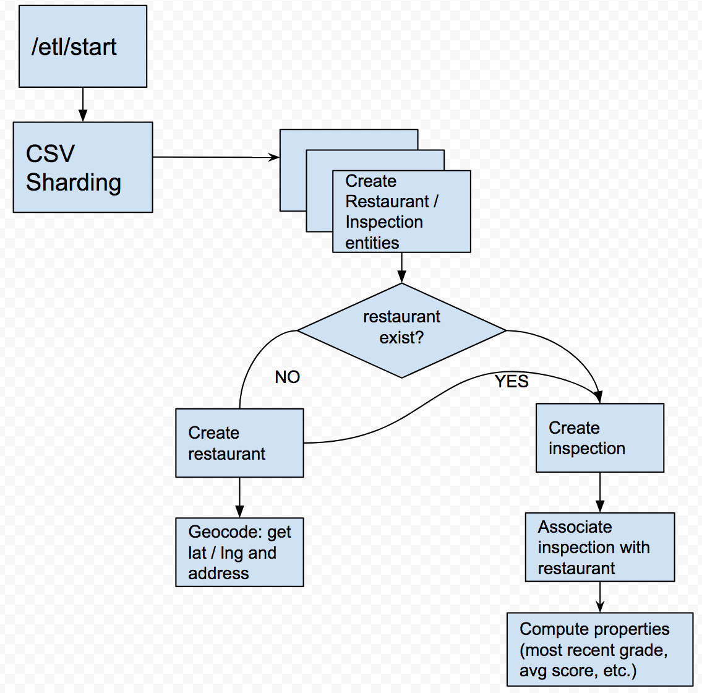
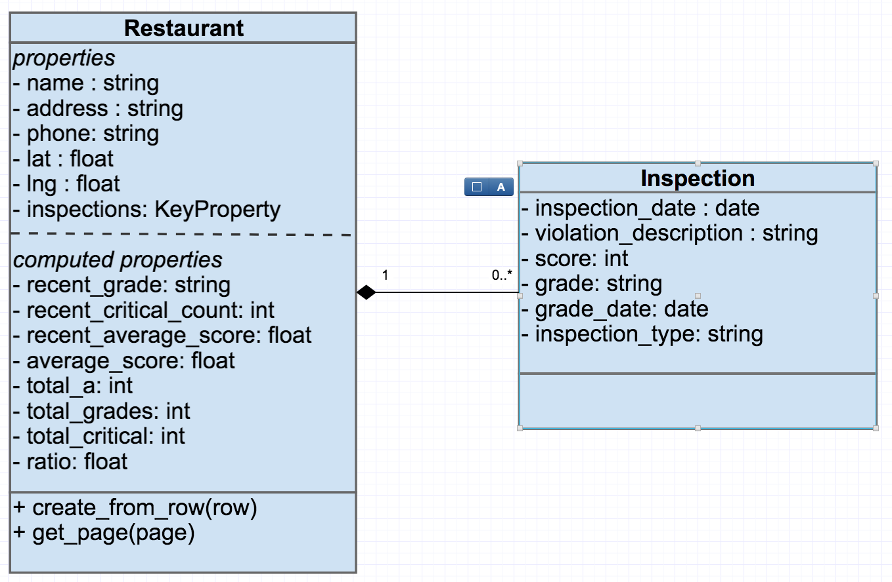

# The Orchard | Restaurant Task

# [Working Solution](https://orchard-restaurant-task.appspot.com/)

### Cloud

The first consideration that went into devisiing a solution for this challenge was related to parsing the CSV file.
I knew that I could have just broken up the file into smaller chunks using a local script and a long process, but I chose to work exclusively in a cloud environment.

Most platforms have limits on request and reponsize sizes, typically maxing out at 32mb. This meant downloading the file directly from NYC Open Data using middleware was not an option. And so I chose to store the file on storage bucket, in this case, using Google Cloud Storage.

The other constraint that I chose is to write the app using the a free cloud account, subject to strict quotas. This means processes can't be running for a long period time (max 30 seconds) and payloads can't exceed a certain size. Reading the CSV file in a single process is not an option, hence my decision to use sharding, more specifically a MapReduce style pipeline that can break up the processing of the file into many workers each ingesting a single row. 

These constraints were chosen to simulate a real world app, where the CSV file could easily be a lot larger, or the input could consist of several large files.

### Middleware

I chose Flask, a microframework that I am fairly familair with and is well suited for a small prototype of this nature.
it also allowed to quickly create views and logic where I could redirect the user to the ETL job page if no data is present in the system or if an ETL job is in flight.

In addition to Flask, I am using Bootstrap for making pages look nice enough for a prototype.

### Platform

I chose to deploy this app to AppEngine / Google Cloud  for its operational simplicty and due to my extensive familiarity with it. Google App Engine is a fully managed platform that completely abstracts away infrastructure so you focus only on code. I was able to quickly iterate and not get bogged down with hosting and deployment.

AppEngine provides a lot of useful librairies

* Pipeline API: connects together complex workflows (including human tasks). The goals are flexibility,
  workflow reuse, and testability. In my case, I am not interested in the Map step since I am mapping CSV rows to complex entites
* Datastore: a NoSQL document database built for automatic scaling, high performance, and ease of application development. One of the main features I am using in my solution is the _Computed Properties_ .
  Computed Properties read-only properties whose value is computed from other property values by an application-supplied function. Computed properties are only computed when updating a record

### ETL

This figure shows the Pipeline process. The CSV is sharded and read one row at a time using the class `restaurantfinder.utils.gcs_reader.GoogleStorageLineInputReader`

Given that I am using the Maps Geocoding API, which is fairly limited for a free account, I decided to filter out Thai restaurants and opt out of modeling the entire CSV into datastore.

In order to see the ETL job in action, I recommend running the reset datastore job first, and then run the ETL job to populate the datastore.

### Schema

A single restaurant has many inspections. With the help of computed properties that are generated during the ETL job. querying by these properties becomes trivial

### Top Rated

There is more than one way to answer this question qualititavely.
With computed properties, I made a bunch of criteria to filter the restaurants and also visualized them on a map using the geo data. If I had a bit more time, I would explored heat maps and various representations of Thai restaurants.

I didnt even consider the restaurants with a B grade due to the large nuimber of restaurants with A grade.
The queries would have been trivial to update.
